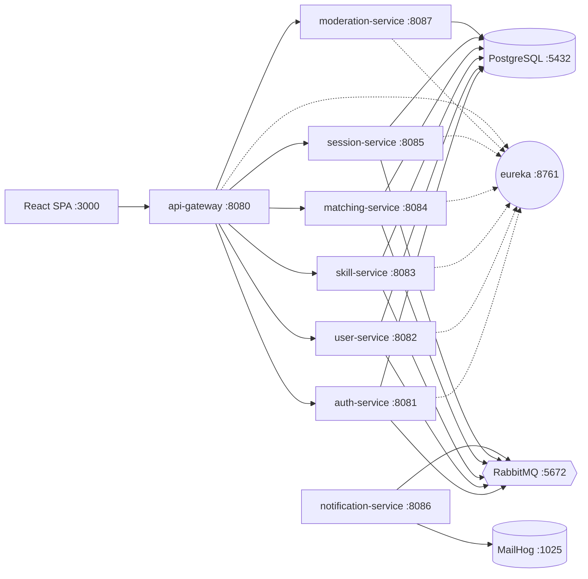

# SkillSwap

[](https://github.com/Frodlik/skillswap-platform/actions/workflows/ci.yml)

> Microservice peer-to-peer skill exchange platform.
> Diploma project — Java 21, Spring Boot 4, Spring Cloud 2025, React 18 SPA.

Users register, list **skill offers** (what they can teach) and **skill wants**
(what they want to learn). The platform proactively suggests partners with a
**transparent, weighted scoring algorithm** (7 scorers, each emits a
human-readable explanation). Sessions are paid in an internal **token
economy** — 4 free tokens on signup, learners spend tokens on lessons, teachers
earn them. Mutual reviews close the loop and feed back into rating-based
match scores. A moderation pipeline (USER / MODERATOR / ADMIN) handles
reports, sanctions, and content takedowns.

---

## Architecture



- **Gateway** routes `/api/v1/{auth,users,skills,matches,sessions,moderation}/**`,
  validates JWT cookies, aggregates per-service Swagger UIs, and applies a
  per-IP rate limit via Bucket4j + Caffeine.
- **Eureka** does service discovery; all services register on startup. Gateway
  pulls the registry every 5 s so cold-start gaps stay short.
- **PostgreSQL 16** — database-per-service: `auth_db`, `user_db`, `skill_db`,
  `matching_db`, `session_db`, `moderation_db`.
- **RabbitMQ 3** — single topic exchange `skillswap.topic`; events use routing
  keys like `user.registered`, `skill.offered`, `match.accepted`,
  `session.proposed`, `session.completed`.
- **JWT RS256** — auth-service issues access + refresh tokens, both delivered
  as `HttpOnly` cookies. Gateway validates the access cookie via a shared
  public key.

---

## Stack

| Layer | Tech |
|---|---|
| Language / runtime | Java 21 (records, sealed interfaces, pattern matching, virtual threads enabled) |
| Backend framework | Spring Boot 4.0, Spring Cloud 2025 |
| Persistence | PostgreSQL 16 + Liquibase (XML changesets) |
| Messaging | RabbitMQ topic exchange (`skillswap.topic`) |
| Service discovery | Spring Cloud Netflix Eureka |
| Edge | Spring Cloud Gateway MVC + Resilience4j circuit breaker + Bucket4j rate limit |
| HTTP client | RestClient (Feign is deprecated in SC 2024+) |
| Auth | JWT RS256, refresh-token rotation, HttpOnly cookie delivery |
| Notifications | Spring Mail + Thymeleaf templates → MailHog (dev) / SMTP (prod) |
| Observability | Micrometer + Prometheus, Grafana dashboards |
| Tests | JUnit 5, Mockito, WireMock, Testcontainers (Postgres + RabbitMQ) |
| Docs | springdoc-openapi 2.6 — aggregated Swagger UI at `/swagger-ui.html` |
| Frontend | React 18 + React Router 6 + Axios + Vite 5 |

---

## Services

| Service | Port | Database | Role |
|---|---|---|---|
| `eureka-server` | 8761 | — | Service discovery |
| `api-gateway` | 8080 | — | Edge routing, JWT cookie validation, rate limit, Swagger aggregator |
| `auth-service` | 8081 | `auth_db` | Registration, login, refresh, logout — issues HttpOnly cookies |
| `user-service` | 8082 | `user_db` | Profiles, preferences, rating, availability schedule |
| `skill-service` | 8083 | `skill_db` | Skill offers/wants, categories, tags, search |
| `matching-service` | 8084 | `matching_db` | Pre-computed match suggestions, 7-scorer weighted breakdown |
| `session-service` | 8085 | `session_db` | Session lifecycle, token wallet, reviews, reports |
| `notification-service` | 8086 | — | Email worker — consumes events, sends via SMTP (no DB) |
| `moderation-service` | 8087 | `moderation_db` | Sanctions (warnings, bans), report queue, content takedowns |

Override any port via `.env` (see `.env.example` for the full list).

---

## Quick start

Prerequisites: Docker Desktop (or Docker Engine + Compose v2), ~6 GB free RAM.

```bash
cp .env.example .env
docker compose up -d --build
```

First build pulls Maven and JDK images and downloads dependencies — ~5 min.
Subsequent builds reuse cached layers.

After the stack is healthy (`docker compose ps` shows all `healthy`):

| What | URL |
|---|---|
| React SPA (dev) | http://localhost:3000 |
| Gateway / Swagger UI (aggregated) | http://localhost:8080/swagger-ui.html |
| Eureka dashboard | http://localhost:8761 (`eureka` / `eureka`) |
| RabbitMQ management | http://localhost:15672 (`guest` / `guest`) |
| MailHog (captured emails) | http://localhost:8025 |
| Gateway health | http://localhost:8080/actuator/health |

Smoke test via Postman: import `postman/skillswap.postman_collection.json` and
run *Auth → Register* → *User → Update profile* → *Skill → Add Offer / Add
Want* → *Match → Get Suggestions* → *Session → Create / Accept / Complete*.
The collection saves cookies and IDs into collection variables, so most
requests are click-through.

Seed a richer dataset (20 users, 80 skills, ~6 sessions in mixed states):

```bash
node scripts/seed.mjs
```

---

## Matching algorithm

Heart of the project — weighted scoring with **7 transparent scorers**:

| Scorer | Default weight | What it measures |
|---|---|---|
| `skill-match` | 0.30 | Direct skill-name match — bilateral / unilateral / category |
| `jaccard` | 0.20 | Tag-set Jaccard similarity in both directions |
| `availability` | 0.15 | Weekly schedule overlap (hours) |
| `reciprocity` | 0.10 | Permissive bilateral check (name OR tag) |
| `language` | 0.10 | Same primary / shared secondary / none |
| `rating` | 0.10 | Normalised candidate rating (0–5 → 0–1) |
| `timezone` | 0.05 | Linear decay from UTC-offset distance |

`TotalScore = Σ wᵢ · sᵢ(A, B)`. Weights are externalised via
`MatchingProperties` (`@ConfigurationProperties`) and overridable per-deploy
through `MATCHING_W_*` env vars — supports A/B tuning without rebuild. Each
scorer returns an `explanation` string that the frontend renders in the
"Why matched" panel of the Matches screen.

Match candidates are **pre-computed**: whenever a user's skills or
preferences change, `matching-service` consumes the event, recomputes scores
against every other active user, and writes the top results into
`matching_db`. The `/matches/suggestions/{userId}` endpoint then becomes a
fast index lookup — important for the matches screen on every login.

Full spec: `docs/matching-algorithm.md`.

---

## Token economy & session consent flow

- **Signup bonus:** 4 tokens credited via the `user.registered` event.
- **Cost:** 1 token = 1 hour. Learner pays, teacher earns.
- **HOLD at PROPOSED:** when a session is proposed, the learner's tokens are
  moved from balance into a HOLD. This prevents a learner from queuing ten
  unanswered proposals that all reserve the same tokens.
- **RELEASE on REJECT / CANCEL:** if the invitee declines or either side
  cancels before the lesson starts, the HOLD goes back to the learner's
  balance.
- **TRANSFER on COMPLETE:** when the session is marked completed, the held
  tokens move to the teacher's balance.

**Consent state machine:**

```
PROPOSED ──accept──► SCHEDULED ──(auto/manual)──► ACTIVE ──complete──► COMPLETED
   │                     │                           │
   │decline              │cancel                     │cancel (teacher only)
   ▼                     ▼                           ▼
REJECTED             CANCELLED                   CANCELLED
```

- Sessions start in **PROPOSED**. Only the *invitee* (the participant who is
  not the proposer) can accept or decline.
- `SessionLifecycleScheduler` auto-promotes SCHEDULED → ACTIVE when the start
  time passes, and ACTIVE → COMPLETED when the duration window ends. Stale
  PROPOSED sessions past their start time auto-cancel.
- **ACTIVE → CANCELLED is teacher-only.** Once a lesson is in progress the
  teacher has invested time; allowing the learner to cancel at minute 50 of a
  60-minute session would force a refund. The frontend hides the *Cancel*
  button for learners on ACTIVE sessions; the backend rejects the request
  with 400 if it slips through.

---

## Moderation

Role hierarchy: `USER` → `MODERATOR` → `ADMIN`. Promoted via direct SQL in
`auth_db.credentials.role` (no API endpoint — promotion is an operator
action). Once promoted, moderators access the `/mod/*` screens in the SPA,
backed by `/api/v1/moderation/**`:

- **Reports queue** — `GET /moderation/reports?status=PENDING`. Reports are
  filed by users via `POST /sessions/{id}/report` and reach moderators
  through this queue.
- **Resolve / dismiss** — `POST /moderation/reports/{id}/resolve` or
  `…/dismiss`. The acting moderator's id flows through the `x-user-id`
  header (set by the gateway from the JWT).
- **Sanctions** — `POST /moderation/sanctions` issues `WARNING`,
  `TEMP_BAN` (with `expiresAt`), or `PERMANENT_BAN`. Listing is filterable by
  `userId` and `type`.
- **Content takedowns** — moderators can delete skills
  (`DELETE /moderation/skills/{id}`) and patch profiles
  (`PATCH /moderation/users/{id}/profile`). Both proxy to the owning service
  via internal endpoints.

---

## Frontend

React 18 SPA in `frontend/`, served by Vite dev server on `:3000`.

```bash
cd frontend
npm install
npm run dev
```

In dev the Vite proxy rewrites `/api/*` to `http://localhost:8080/api/*`
(the gateway), so cookies flow through transparently. In production the SPA
ships alongside the gateway.

Auth is fully cookie-based: a successful `/auth/login` sets `access_token`
and `refresh_token` as `HttpOnly` cookies. A response interceptor in
`frontend/src/api/client.js` watches for 401s, calls `/auth/refresh`, and
retries the original request — concurrent 401s share a single in-flight
refresh promise so refresh-token rotation can't race itself.

Eight screens are implemented:

| Screen | Path | Purpose |
|---|---|---|
| Login / Register | `/login`, `/register` | Cookie auth |
| Dashboard | `/dashboard` | Wallet balance, upcoming sessions, latest suggestions |
| Matches | `/matches` | Weighted match list + score breakdown + accept/decline + schedule modal |
| Browse | `/browse` | Skill catalogue search |
| Profile | `/profile`, `/users/:id` | Edit own / view someone else's |
| Skills | `/skills` | Manage offers and wants |
| Sessions | `/sessions` | All sessions, status actions, reviews, reports |
| Wallet | `/wallet` | Balance + transaction history |
| Moderator | `/mod/*` | Reports queue, sanctions, users (MODERATOR only) |

See `docs/frontend-guide.md` for a per-file walkthrough.

---

## Local development without Docker

For iterating on a single service, run only the infra:

```bash
docker compose -f docker-compose.dev.yml up -d   # postgres + rabbitmq + mailhog
mvn -pl eureka-server spring-boot:run            # start order matters
mvn -pl api-gateway spring-boot:run
mvn -pl auth-service spring-boot:run             # then any business service
```

The frontend connects to the gateway on `:8080`, so as long as the gateway
plus the services you care about are up, the SPA works.

---

## Configuration

Environment variables (full list in `.env.example`):

| Key | Default | Used by |
|---|---|---|
| `POSTGRES_HOST` / `POSTGRES_PORT` | `localhost` / `5432` | All services |
| `POSTGRES_USER` / `POSTGRES_PASSWORD` | `skillswap` / `skillswap` | All services |
| `RABBITMQ_HOST` / `RABBITMQ_PORT` | `localhost` / `5672` | All services |
| `EUREKA_HOST` / `EUREKA_PORT` | `localhost` / `8761` | All services + gateway |
| `JWT_PRIVATE_KEY` / `JWT_PUBLIC_KEY` | `classpath:keys/*.pem` | Auth issues, gateway validates |
| `CORS_ALLOWED_ORIGINS` | `http://localhost:3000` | Gateway |
| `MAIL_HOST` / `MAIL_PORT` | `smtp.gmail.com` / `587` | Notification service |
| `MATCHING_W_*` | see `matching-service/application.yml` | Per-scorer weight override |
| `RATE_LIMIT_AUTH_RPM` / `RATE_LIMIT_API_RPM` | `100` / `200` | Gateway Bucket4j |

`.env` is gitignored; commit only `.env.example` with safe placeholders.

---

## Tests

```bash
mvn test
```

26 test classes across all modules: unit (Mockito), integration
(Testcontainers spins up Postgres + RabbitMQ + WireMock), and gateway/auth
smoke tests. Docker Desktop must be running for integration tests.

---

## Troubleshooting

- **"Service unavailable" on the first request after `docker compose up`.**
  Gateway is waiting on Eureka to publish the registry. With the tuned
  `registry-fetch-interval-seconds: 5` and LoadBalancer retry, the window
  is short — but if you hit it, retry once. If it persists, check Eureka
  at `:8761` to confirm the target service registered.
- **"401 Unauthorized" on every request from the SPA.**
  The dev proxy is required for cookies to flow. Make sure you opened
  `http://localhost:3000` (proxy through Vite), not the Vite preview port,
  and that `withCredentials` is implicit on Axios calls (already configured).
- **Liquibase checksum errors after editing a changeset.**
  Don't edit existing changesets — append a new one. If you must,
  `liquibase clear-checksums` against the affected db.
- **Tests fail with "Could not find a valid Docker environment".**
  Testcontainers needs Docker running. Start Docker Desktop.
- **Email sent to Gmail goes to spam in dev.**
  Use MailHog (`:8025`) instead: it captures every email locally so you can
  verify subject lines, templates, and recipient logic without touching
  real SMTP.

---

## Layout

```
skillswap-platform/
├── eureka-server/          # service discovery
├── api-gateway/            # edge: routing, JWT cookie validation, Swagger aggregator
├── auth-service/           # JWT issuer (HttpOnly cookies)
├── user-service/           # profiles + preferences + rating
├── skill-service/          # skill catalogue
├── matching-service/       # ⭐ scoring engine (focus of the diploma)
├── session-service/        # bookings + token wallet + reviews + reports
├── notification-service/   # email worker (no DB)
├── moderation-service/     # sanctions + reports queue + takedowns
├── frontend/               # React 18 SPA (Vite)
├── docker/                 # postgres init scripts (creates per-service databases)
├── postman/                # API smoke-test collection
├── docker-compose.yml      # full stack
├── docker-compose.dev.yml  # infra only (postgres + rabbitmq + mailhog)
└── Dockerfile              # shared by all 8 backend modules (build-arg SERVICE)
```
