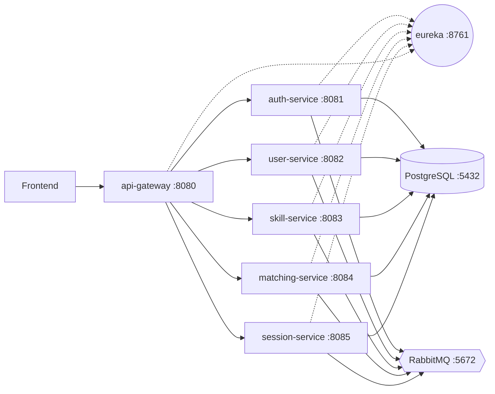

# SkillSwap

[](https://github.com/Frodlik/skillswap-platform/actions/workflows/ci.yml)

> Microservice-based peer-to-peer skill exchange platform.
> Diploma project — Java 21, Spring Boot 4, Spring Cloud 2025.

Users register, list **skill offers** (what they can teach) and **skill wants** (what they want to learn), and the platform proactively suggests matches with a **transparent, weighted scoring algorithm**. Sessions are paid in an internal **token economy** (4 free tokens on signup, earn by teaching, spend on learning). Mutual reviews close the loop and feed back into the matching score.

---

## Architecture



- **Gateway** routes `/api/v1/{auth,users,skills,matches,sessions}/**` and aggregates Swagger UI.
- **Eureka** does service discovery; services register on startup.
- **PostgreSQL 16** — database-per-service: `auth_db`, `user_db`, `skill_db`, `matching_db`, `session_db`.
- **RabbitMQ 3** — single topic exchange `skillswap.topic`; events use routing keys like `user.registered`, `skill.offered`, `match.accepted`, `session.completed`.
- **JWT RS256** — auth-service issues, gateway validates via shared public key.

Detailed boundaries: [`obsidian/skillswap/Architecture/Service Boundaries.md`](obsidian/skillswap/Architecture/Service%20Boundaries.md).

---

## Stack

| Layer | Tech |
|---|---|
| Language / runtime | Java 21 (virtual threads enabled) |
| Framework | Spring Boot 4.0, Spring Cloud 2025 |
| Persistence | PostgreSQL 16 + Liquibase XML changesets |
| Messaging | RabbitMQ topic exchange |
| Service discovery | Spring Cloud Netflix Eureka |
| Edge | Spring Cloud Gateway MVC + Resilience4j circuit breaker |
| HTTP client | RestClient (Feign deprecated in SC 2024+) |
| Auth | JWT RS256, refresh tokens |
| Tests | JUnit 5, Mockito, WireMock, Testcontainers |
| Docs | springdoc-openapi 2.6 (Swagger UI per service) |

---

## Quick start

Prerequisites: Docker Desktop (or Docker Engine + Compose v2), ~6 GB free RAM.

```bash
cp .env.example .env
docker compose up -d --build
```

First build pulls Maven and JDK images and downloads dependencies — ~5 minutes. Subsequent builds use cached layers.

After the stack is healthy (`docker compose ps` shows all `healthy`):

| What | URL |
|---|---|
| Swagger UI (aggregated, all services) | http://localhost:8080/swagger-ui.html |
| Eureka dashboard | http://localhost:8761 (eureka / eureka) |
| RabbitMQ management | http://localhost:15672 (guest / guest) |
| Gateway health | http://localhost:8080/actuator/health |

Smoke test via Postman: import [`postman/skillswap.postman_collection.json`](postman/skillswap.postman_collection.json) and run *Auth → Register* (auto-saves token) → *User → Update profile* → *Skill → Add Offer/Want* → *Match → Get Suggestions*.

---

## Services

| Service | Port | Database | Role |
|---|---|---|---|
| `eureka-server` | 8761 | — | Service discovery |
| `api-gateway` | 8080 | — | Edge routing, JWT validation, Swagger UI aggregator |
| `auth-service` | 8081 | `auth_db` | Registration, login, JWT issuance/refresh |
| `user-service` | 8082 | `user_db` | Profiles, preferences, rating |
| `skill-service` | 8083 | `skill_db` | Skill offers/wants, categories, tags |
| `matching-service` | 8084 | `matching_db` | Pre-computed match suggestions, scored breakdown |
| `session-service` | 8085 | `session_db` | Session lifecycle, token wallet, reviews |

Override any port via env vars in `.env` (see [`.env.example`](.env.example)).

---

## Matching algorithm

Heart of the project — weighted scoring with **7 transparent scorers**:

| Scorer | Default weight | What it measures |
|---|---|---|
| `skill-match` | 0.30 | Direct skill name match (bilateral / unilateral / category) |
| `jaccard` | 0.20 | Tag-set Jaccard similarity in both directions |
| `availability` | 0.15 | Schedule overlap (hours per week) |
| `reciprocity` | 0.10 | Permissive bilateral check (name OR tag) |
| `language` | 0.10 | Same primary / shared secondary / none |
| `rating` | 0.10 | Normalised candidate rating |
| `timezone` | 0.05 | Linear decay from UTC offset distance |

`TotalScore = Σ wᵢ · sᵢ(A,B)`. Weights are externalised via `MatchingProperties` (`@ConfigurationProperties`) and overridable per-deploy through env vars `MATCHING_W_*` — supports A/B tuning without rebuild. Each scorer returns a human-readable `explanation` that the frontend renders as "Why matched" panel.

Full spec: [`docs/matching-algorithm.md`](docs/matching-algorithm.md).

---

## Local development (without Docker for services)

For iterating on a single service, run only the infra:

```bash
docker compose -f docker-compose.dev.yml up -d   # postgres + rabbitmq
mvn -pl eureka-server spring-boot:run            # then any service in another terminal
mvn -pl auth-service spring-boot:run
```

See [`obsidian/skillswap/Runbooks/Local Development.md`](obsidian/skillswap/Runbooks/Local%20Development.md) for full service start order.

---

## Tests

```bash
mvn test
```

Total: 142 tests across all 8 modules. Testcontainers (Postgres + RabbitMQ + WireMock) is required for integration tests — Docker Desktop must be running.

---

## Layout

```
skillswap-platform/
├── eureka-server/         # service discovery
├── api-gateway/           # edge: routing, JWT, Swagger aggregator
├── auth-service/          # JWT issuer
├── user-service/          # profiles + preferences
├── skill-service/         # skill catalogue
├── matching-service/      # ⭐ scoring engine (focus of the diploma)
├── session-service/       # bookings + token wallet + reviews
├── docker/                # postgres init script
├── docs/                  # technical specs (mvp-roadmap, matching-algorithm)
├── obsidian/skillswap/    # vault: architecture, decisions, runbooks
├── postman/               # API smoke-test collection
├── docker-compose.yml     # full stack
├── docker-compose.dev.yml # infra only (postgres + rabbitmq)
└── Dockerfile             # shared by all 7 modules (build-arg SERVICE)
```
